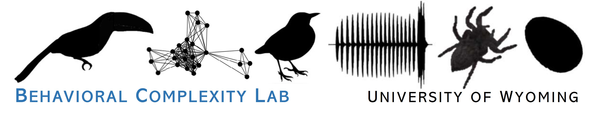

Welcome to the Behavioral Complexity Lab at the University of Wyoming. We are very broadly interested in how environments shape individual behavior and how these behaviors impact vulnerability to selective agents (such as climate or predation). Focusing mainly on tropical birds in Panama and Hawaii (but branching out into other taxa too), our research integrates intensive field-based studies of multiple taxa, quantitative behavioral analysis (especially bioacoustics), artificial intelligence, and ecological causal modeling to explore the interplay between natural selection and complex phenotypes. To this end, we explore novel ways to detect and measure complex behaviors that form the basis of fundamental ecological phenomena such as competition and predation.

