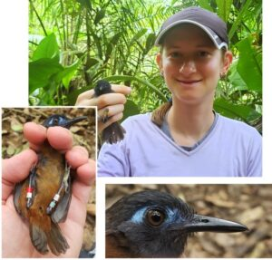

### Erin Stewart (MS student)

Erin is a graduate student at the University of Wyoming pursuing a master’s degree in Zoology & Physiology. Erin’s primary research interests include animal behavior and communication, ornithology, and conservation biology, and her thesis work will be conducted as part of the Panama PLUMAS Project. Prior to attending UW, Erin obtained a B.S. in Biology from the University of Puget Sound, during which she completed an undergraduate thesis on the effects of wildfire and beaver dams on stream macroinvertebrates. Subsequently, she worked as a field technician in Idaho, California, Georgia, and Florida studying Ridgway’s Rails, Greater Sage-Grouse, Ruffed Grouse, and plant demography. In addition, she is very interested in science communication and journalism, and has contributed to science magazines and blogs. When not working, she likes playing board games such as Wingspan, and, when not working AND not thinking about birds, she enjoys hiking, baking, reading travel memoirs and murder mysteries, and watching tiny house tours.

### Michael Castaño (MS student)

Michael Castaño is a biologist from the University of Antioquia (Medellín – Colombia). His main interests relate to evolutionary ecology and conservation, behavioral ecology, biogeography, and ethnobiology. Michael completed his undergraduate thesis understanding how mixed-species flocks were structured and how their foraging niches varied along a precipitation and fragmentation gradient in the Isthmus of Panama as part of the PLUMAS project. Michael has also collaborated for the conservation of Antioquia brushfinch (Atlapetes blancae), a critically endangered bird in Colombia, and in other projects to understand the distribution of tropical birds in altitude gradients. In January 2023, Michael also served as a Teaching Assistant for University of Wyoming’s WyoPanama field course (HP-4152). Michael’s other interests are scientific dissemination and citizen science. On a personal level, Michael enjoys reading, writing, and dancing. 
